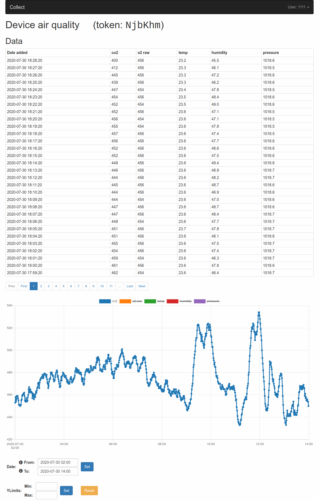

# Data collection and visualisation

A django application for storing and displaying data collected by iot devices, with plots created using chart.js.


## Usage

 * Create user account
 * Create a device and write down the generated API key
 * Build a device that sends data to the server using the given API key; some examples can be found at <https://github.com/tklos/iot>.<br/>
   Sample API call:
   ```bash
   curl -X POST https://(server)/api/measurements/ -H "API-KEY: (api-key)" -H "Content-Type: application/json" -d '{"data": (list-of-floats)}'
   ```
 * Collected data are shown on the device page



## Installation

 * Clone the repository
 * Create a Python 3.8 virtual environment
 * Create `collect/settings/default.py` based on its `.template` version

